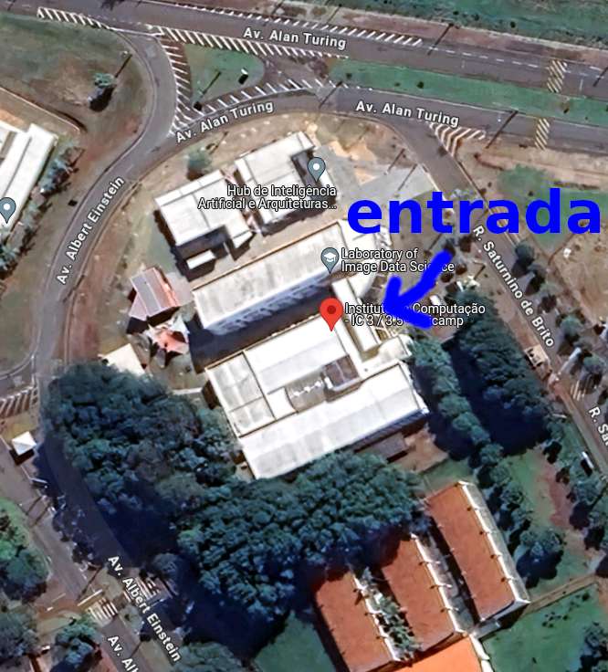

## Local e Horários

Os encontros serão às sextas-feiras das 14h às 18h no Instituto de Computação, prédio IC 3/3.5, laboratório CC05 (também chamado sala 305).

### Como chegar no local

O Instituto de Computação possui mais de um prédio. O IC 3/3.5 fica logo no início da rua Saturnino de Brito (veja imagem abaixo).

Este é o endereço no [Google Maps](https://maps.app.goo.gl/uhgVRw3zTV51Z7Mm8).

A entrada do prédio é indicada na foto a seguir:

## Cronograma de Aulas

Nosso primeiro encontro será no dia 02/08 e já podem participar dele os alunos que tenham solicitado alteração de matrícula, mesmo antes de sair o resultado.

## Endereços Importantes

* [Página Principal da Disciplina](/)
* [Google Classroom da Disciplina](https://classroom.google.com/c/NzAxMjYyOTM2NTcx)

